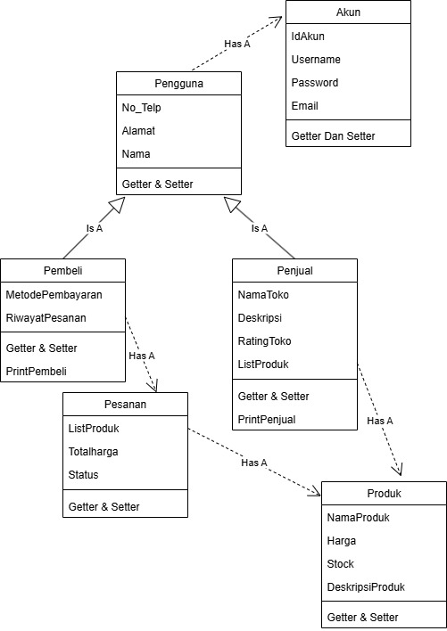

Saya Julia Rahmawati dengan NIM 2400742 mengerjakan TP 1 dalam mata kuliah Desain Pemrograman Berorientasi Berorientasi Objek untuk keberkahan-Nya, maka saya tidak akan melakukan kecurangan seperti yang telah di spesifikasikan Aamiin.

### Gambar Desain Diagram Program

### Penjelasan Atribut & Method
##### 1. Class Akun
Didalam kelas akun terdapat 4 atribut yaitu : 
1. IdAkun untuk ID unik dari setiap akun yang di buat.
2. Username untuk identitas akun untuk di pakai ketika login.
3. Password untuk memverifikasi identitas akun ketika login.
4. Email untuk identitas ketika login dan kontak resmi akunnya.
Didalam kelas akun terdapat 2 methdod yaitu :
1. Getter dan Setter untuk akses dan ubah atribut.
2. printAkun untuk menampilkan detail akun.
##### 2. Class Pengguna
Didalam kelas Pengguna terdapat 3 atribut yaiut:
1. No_tlp untuk kontak yang bisa di hubungi.
2. Alamat, lokasi tempat tinggal atau domisili pengguna dan alamat dari toko jika pengguna adalah penjual.
3. Nama, nama asli atau panggilan dari pengguna.
Didalam kelas Pengguna terdapat 2 methods yaitu :
1. Getter dan Setter untuk akses dan ubah atribut.
2. printPengguna untuk menampilkan detail akun.
##### 3. Class Pembeli
Didalam kelas Pembeli terdapat 2 atribut yaitu :
1. MetodePembayaran, jenis metode yang di gunakan pengguna seperti ShopeePay, Transfer Bank.
2. RiwayatPesanan, list pesanan yang pernah di lakukan pengguna.
Didalam kelas Pembeli terdapat 2 method yaitu :
1. Getter dan Setter untuk akses dan ubah atribut.
2. printPembeli untuk menampilkan data Pembeli + data pengguna.
##### 4. Class Penjual 
Didalam kelas Penjual terdapat 4 atribut yaitu :
1. NamaToko, untuk nama dari toko si penjual.
2. Deskripsi, untuk mendeskripsikan tentang toko.
3. RatingToko, seperti 4,8 dari 5
4. ListProduk, daftar produk yang dijual.
Didalam kelas penjual terdapat 3 methods yaitu :
1. Getter dan Setter, untuk akses dan ubah atribut.
2. tambahProduk, menambahkan produk baru ke toko.
3. printPenjual, menampilkan data penjual + data pengguna.
##### 5. Class Pesanan
Didalam kelas Pesanan terdapat 3 atribut yaitu :
1. TotalHarga, total dari semua produk dalam pesanan yang di buat.
2. Status, status pesanan dalam kondisi di prosesm, di batalkan atau selesai.
3. ListProduk, untuk daftar produk yang di pesan.
Didalam kelas pesanan terdapat 3 methods yaitu :
1. Getter dan Setter untuk akses dan ubah atribut.
2. TambahProduk, untuk menambhkan produk ke dalam pesanan.
3. printPesanan, untuk menampilkan isi daftar produk dalam pesanan, total dari harga dan statusnya.
##### 6. Class Produk
Didalam kelas Produk terdapat 5 atribut yaitu :
1. IdProduk, untuk ID unik dari setiap produk yang ada.
2. Nama, untuk nama produknya.
3. Harga, untuk harga dari produknya.
4. Stok, untuk jumlah stok yang tersedia.
5. Kategori, untuk jenis produknya.
Didalam kelas Produk terdapat 2 methods yaitu :
1. Getter dan Setter untuk akses dan ubah atribut.
2. printProduk, untuk menampilkan detail produknya.

### Penjelasan Desain Program 
Program ini mensimulasikan sistem e-commerce sederhana, dimana penjual dapat menambahkan produk, dan pembeli dapat memesan produk tersebut. Data pengguna di simpan atau di kelola di akun. Program ini terdiri dari 6 kelas yaitu : Akun, Pengguna, Penjual, Pembeli, Produk, dan Pesanan.
1. Kelas Pengguna adalah kelas induk dari Pembeli dan Penjual (Inheritance).
2. Kelas Pembeli punya RiwayatPesanan (Composition Pesanan), jadi setiap pembeli akan mempunyai riwayat dari pesannan yang pernah di lakukakannya.
3. Penjual punya ListProduk(Composition Produk), jadi seorang penjual punya toko dan toko itu punya banyak produk yang di jual.
4. Pesanan berisi ListProduk (Composition Produk), jadi pesanan mempunyai produk produk yang pernah di beli oleh pembeli.
5. Pengguna punya akun (Composition), jadi setiap 1 pengguna akan punya 1 akun.

### Penjelasan Alur ( Python)
1. Membuat Akun
Saya membuat 3 objek akun : akun_pembeli, akun_penjual, dan akun_penjual1. Data berisi id, usename, password, dan email.
2. Buat Pengguna (Pembeli dan Penjual)
Dari akun yang di buat tadi dibikin 3 objek : pembeli1, penjual1, dan penjual2. Pembeli dan Penjual mewarisi Pengguna dan pengguna memiliki akun.
3. Buat Produk
Bikin 5 objek produk : laptop, HP, Buku, Baju, dan Panci. Setiap produk punya id, nama, harga, stok, dan kategori.
4. Tambahkan Produk ke Penjual
penjual1 menjual laptop dan HP, penjual2 menjual buku. Produk di masukkan ke ListProduk.
5. Buat Pesanan oleh Pembeli
pembeli1 memesan produk Laptop, Buku, danpanci, program menghitung total harga dan membuat objek pesanan1 dengan status "Diproses".
6. Tambahlan Pesanan ke Riwayat Pembeli.
pesanan1 masuk ke RiwayatPesanan punya pembeli1. Jadi pembeli1 punya 1 pesanan di riwayat pesanan miliknya.
7. Tampilkan Data Pembeli dan Riwayat Pesanan
Program memanggil pembeli1.printPembeli, lalu bikin tabel riwayat pesanan yang berisi ID produk, nama, harga, stok, dan kategori. Setelah tabel, dicetak juga total harga dan status pesanan.
8. Tampilkan data Penjual dan Produk yang di jual
Program cetak data penjual penjual1.printPenjual, lalu buat tabel semua produk yang dijual oleh penjual. Dan terakhir tampilkan dengan format yang sama seperti riwayat peesanan.
